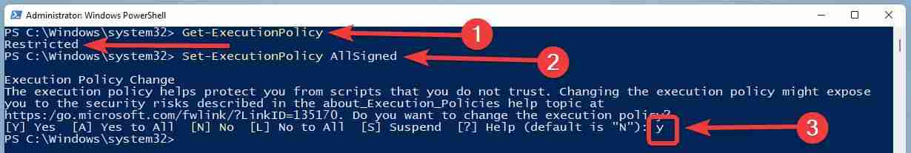

# Chocolatey

## Installation
Open PowerShell as Admin

Type in the following command

```shell
Get-ExecutionPolicy
```

If it says ‘Restricted’ as shown

```shell
Set-ExecutionPolicy AllSigned
```

You will have to type ‘Y’ and hit the enter key when you will be asked for a confirmation.



Copy-paste the following command and hit the enter key

```shell
Set-ExecutionPolicy Bypass -Scope Process -Force; [System.Net.ServicePointManager]::SecurityProtocol = [System.Net.ServicePointManager]::SecurityProtocol -bor 3072; iex ((New-Object System.Net.WebClient).DownloadString('https://chocolatey.org/install.ps1'))
```

## Packages

```shell
choco install unikey winrar foxitreader everything k-litecodecpackfull
choco install firefox notepadplusplus.install
```

```shell
# Install commonly used packages 
$packages = 'powershell','googlechrome','firefox', 'git.install', 'notepadplusplus.install','atom','adobereader','7zip.install','javaruntime','vlc','putty.install','sysinternals','transmission','mRemoteNG' 
ForEach ($package in $packages) 
{ 
choco install $package -y 
} 
```

### Install Command Line 
```shell
choco install notepadplusplus googlechrome atom 7zip 
choco install git -y --install-args="'/DIR=E:\PROGRAM\Chocolatey\tools'" 
choco install filezilla --% -y --ia="/D=D:\PROGRAM\FileZilla"  
choco install nodejs.install --version 0.10.35 
```

### Uninstall Command Line 
```shell
choco uninstall notepadplusplus googlechrome atom 7zip 
choco uninstall ruby --version 1.8.7.37402 
choco uninstall nodejs.install --all-versions 
```
