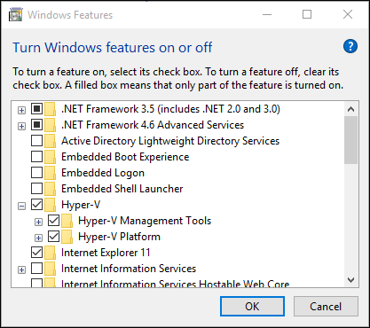
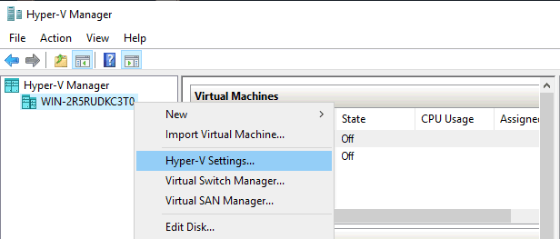
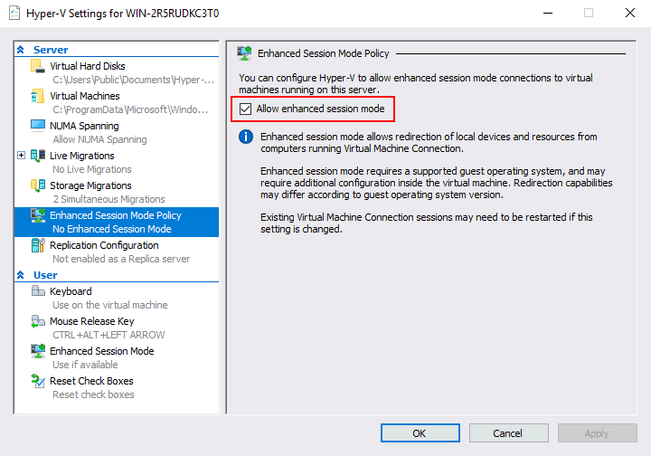

# Hyper-V

## Enable Hyper-V
**Method 1**: Enable Hyper-V using PowerShell

Run PowerShell as adminstrator
```shell
Enable-WindowsOptionalFeature -Online -FeatureName Microsoft-Hyper-V -All
```

**Method 2**: Enable Hyper-V with CMD and DISM

Run CMD as adminstrator
```shell
DISM /Online /Enable-Feature /All /FeatureName:Microsoft-Hyper-V
```

**Method 3**:. Enable the Hyper-V role through Settings

`Programs and Features > Turn Windows Features on or off > Hyper-V` 



## Activate enhanced session mode for Ubuntu VMs in Hyper-V
Link: https://4sysops.com/archives/activate-enhanced-session-mode-for-ubuntu-vms-in-hyper-v/
Link: https://www.nakivo.com/blog/install-ubuntu-20-04-on-hyper-v-with-enhanced-session/

```shell
curl -s https://raw.githubusercontent.com/Hinara/linux-vm-tools/ubuntu20-04/ubuntu/20.04/install.sh | bash
```




```shell
Set-VM -VMName "UDT-20" -EnhancedSessionTransportType HvSocket
```