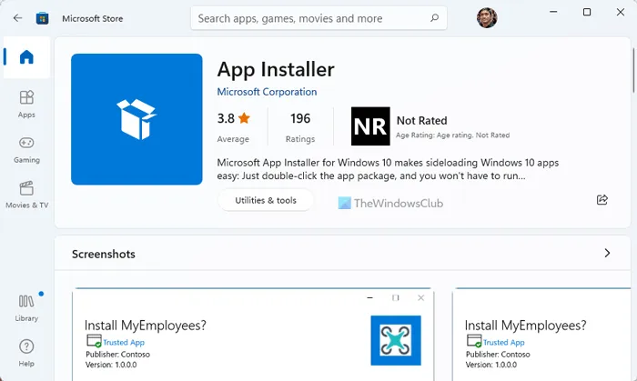

# Terminal

### Installation
If Winget is not recognized in Windows 11, download or update App Installer



Open PowerShell as Administrator

```shell
Set-ExecutionPolicy RemoteSigned
# Install Scoop
iwr -useb get.scoop.sh | iex 

winget install JanDeDobbeleer.OhMyPosh

# Install packages
Install-Module posh-git -Force
Install-Module PSReadLine -Force
Install-Module -Name Terminal-Icons -Repository PSGallery -Force
Install-Module -Name Z -Force

# Fuzzy finder
scoop install fzf
Install-Module -Name PSFzf -Force
```

Edit your PowerShell profile script `notepad $PROFILE`. Then add the following line

```shell
# Load prompt configs
oh-my-posh init pwsh --config "$env:POSH_THEMES_PATH\M365Princess.omp.json" | Invoke-Expression

# PowerShell environment for Git
Import-Module posh-git

# Terminal-Icons
Import-Module Terminal-Icons

# PSReadLine
Import-Module PSReadLine
Set-PSReadLineOption -PredictionSource History
Set-PSReadLineOption -PredictionViewStyle ListView

# Fzf
Import-Module PSFzf
Set-PsFzfOption -PsReadLineChordProvider 'Ctrl+f' -PSReadLineChordReverseHistory 'Ctrl+r'

# Alias (Optional)
Set-Alias g git
Set-Alias ll ls
Set-Alias grep findstr

# Ultilities (Optional)
function which ($command) {
    Get-Command -Name $command -ErrorAction SilentlyContinue |
        Select-Object -ExpandProperty Path -ErrorAction SilentlyContinue
}
```